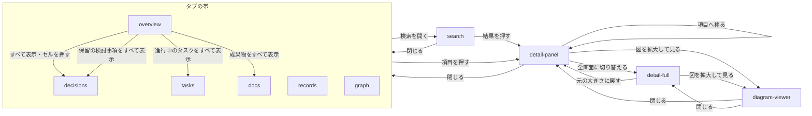

# プレビュー

## 現状

| 分類 | ページ / ファイル | 概要 | 補足 |
| --- | --- | --- | --- |
| ドキュメント | [設計書/アーキテクチャ図/アーキテクチャ図.yaml](https://github.com/shuhei1101/mindmap/blob/develop/dev/%E8%A8%AD%E8%A8%88%E6%9B%B8/%E3%82%A2%E3%83%BC%E3%82%AD%E3%83%86%E3%82%AF%E3%83%81%E3%83%A3%E5%9B%B3/%E3%82%A2%E3%83%BC%E3%82%AD%E3%83%86%E3%82%AF%E3%83%81%E3%83%A3%E5%9B%B3.yaml) | プレビューのサブシステム（予定）と外部システムの CDN（銘柄未定） | 更新対象 |
| ドキュメント | [設計書/非機能要件/非機能要件.yaml](https://github.com/shuhei1101/mindmap/blob/develop/dev/%E8%A8%AD%E8%A8%88%E6%9B%B8/%E9%9D%9E%E6%A9%9F%E8%83%BD%E8%A6%81%E4%BB%B6/%E9%9D%9E%E6%A9%9F%E8%83%BD%E8%A6%81%E4%BB%B6.yaml) | ブラウザ・画面サイズ・入力方式・通信の行がある | 描画の性能の行を足す |
| 実装 | [skills/mindmap/preview/template.html](https://github.com/shuhei1101/mindmap/blob/develop/skills/mindmap/preview/template.html) | 埋め込みのデータから種類ごとの件数を並べるだけの雛形 | 画面の中身に差し替える |
| 見本 | `tmp/preview-mock/`（ローカル、git の外） | `index.html`・`style.css`・`app.js`（約 80KB）・`data.js`（見本のデータ） | 要件の出所。コードは参考 |

画面の設計書（シナリオ・画面設計・部品設計・モジュール構成）はまだ無い。

## 変更方針

| 対象 | 方針 | 補足 |
| --- | --- | --- |
| 画面の構成 | 1 枚の HTML の中で、タブ（概要・検討事項・タスク・調査・資料・用語集・メモ・会話ログ）と、帯の右端のつながりを切り替える。詳細パネル・検索は重ねて出す | 画面一覧・画面遷移で確定する |
| データの読み込み | `build` が埋め込んだ `mindmap-data` の中身を `JSON.parse` して読み、画面の中ではデータを書き換えない | 埋め込みの形はインターフェース定義『プレビューの書き出し』のとおり |
| 閲覧機能 | 表示形式（マップ / カード / 表 / ボード）を画面ごとに切り替え、既定の形式は要件の表のとおり | 切り替えのボタンはどのタブでも同じ位置・同じ幅 |
| 検索機能 | トップバーの全体検索（ID・タイトル・本文）と、マップの中のキーワードの強調を分けて持つ | - |
| 表の操作 | 並べ替え・列の絞り込み・ピン留め・表示する列・初期設定に戻すを、全ての表で共通の部品にする | 部品設計で部品にする |
| 状態の保持 | 画面と開いている項目は URL のハッシュに持つ。ライト / ダーク・表示する列は端末の保存領域に持つ | 表の絞り込みの条件は保存しない |
| つながり | ライブラリを使わず、キャンバスに透視で平たい円を描く自前の描画にする。画面の外は描かず、文字は倍率を描くときにかける。玉の上の文字は玉ごとに一度だけ画像に描いておき、毎コマはその画像を倍率をかけて置く | 毎コマ `fillText` で描くと 150 件から落ちたコマが基準を超える（PoC 結果） |
| Markdown と図 | marked で描画し DOMPurify で無害化してから差し込む。mermaid の図は「拡大して見る」「Raw」「コピー」を持つ | 埋め込みのデータは利用者の記録のため、無害化を通さずに差し込まない |
| 描画のライブラリの読み込み | marked・DOMPurify・elkjs・mermaid を、版を固定し integrity を付けて CDN から読む。読めなかったときは、読めなかったライブラリの名前を画面に出す | CDN の銘柄は外部ライブラリの設計で決める |
| 文字 | Google Fonts（Inter・Noto Sans JP・JetBrains Mono）を読む（デザインスタイル dev-swiss-cards の採用。[確認ログ](./確認ログ.md)） | アーキテクチャ図の制約と外部システムに文字の読み込みを足す |
| アクセシビリティ | 押せるものはボタンかリンクにし、キーボードで全ての操作に届く。フォーカスの見せ方をホバー・選択中と分ける | - |
| レスポンシブ対応 | 狭い幅ではマップを字下げした縦の一覧にする。幅が 1100px 以上（マップは 901px 以上）のときは詳細パネルの分だけ本文を寄せる | 境の幅は非機能要件の画面サイズに合わせる |
| アニメーション | 自動で動くアニメーションを入れない。選んだときの線の流れと、つながりの動きだけを、速すぎない速さで動かす | - |
| 性能 | つながりで扱う項目の数を 1000 件とし（[確認ログ](./確認ログ.md)）、その件数で落ちたコマ 1% 以下・1 コマの処理時間 p95 8ms 以下・使うメモリを非機能要件に数値で置く | 持ち越した課題「つながりの重さ」。値の根拠は `## PoC 結果`。根拠の欄と動作環境のページの補足に、測った端末（Windows・Chrome 154・Ryzen 7 9800X3D・RTX 5070・143Hz）と、それより低い性能の端末は確かめていないことを書く |
| ブラウザ対応 | 非機能要件の `ブラウザ` の行のとおり | - |
| テスト | 画面の操作はブラウザを動かすテストで確かめる。使う道具はライブラリ選定で決める | テスト実行方法に前提とコマンドを足す |

### 画面一覧

| 種別 | 画面 | 概要 | アクション | 判定の根拠 | 補足 |
| --- | --- | --- | --- | --- | --- |
| 新規 | `components/topbar` | トップバーとタブの帯（全画面で共通） | タブを押して画面を移る<br>つながりを開く<br>全体の検索を開く（ボタン・`/` キー）<br>ライト / ダークを切り替える | タブ: 同じ記録の、関連するが別のまとまりのため、画面内のタブにする。行き来する画面が 9 つで「5 つを超えるなら横のメニュー」に当たるが、要件と見本どおり横に並べ、収まらないときは帯の中で横に送る | タブにアイコンと件数を付ける（[確認ログ](./確認ログ.md)）。つながりは帯の右端に分けて置く |
| 新規 | `components/table` | 表（全てのタブの表で共通の部品） | 列の見出しで並べ替える（昇順 → 降順 → 解除）<br>列の見出しから値を選んで絞り込む（ポップオーバー）<br>条件のチップを外す・すべて外す<br>押した列までピン留めする・外す<br>表示する列を選ぶ（ポップオーバー）<br>初期設定に戻す<br>行を押して詳細を開く | 絞り込みは同じ内容の絞り込みのため、同じ画面の中で表示を切り替える | 操作してもスクロールの位置を保つ。絞り込みの条件は保存しない |
| 新規 | `components/view-switch` | 表示形式の切り替え（`decisions`・`tasks`・`docs` で共通の部品） | 表示形式を切り替える | 同じ内容の見せ方の切り替えのため、同じ画面の中で切り替える（セグメント） | どのタブでも同じ位置・同じ幅に置き、切り替えで周りの枠の幅や高さを変えない（ちらつかせない） |
| 新規 | `overview` | 概要（既定で開く画面） | 次に検討する項目（タイルの枠に収まるだけ）から項目を開く<br>次に検討する項目をすべて表示する（検討事項の表を、状態 = 未決定 × 着手できる = はいで絞って開く）<br>成果物のチェックリストを見る・成果物が 5 件を超えたら資料を成果物で絞って開く<br>要見直し・保留・進行中のタスクの項目を開く<br>要見直しをすべて表示する（検討事項の表を状態 = 要見直しで絞って開く）<br>保留をすべて表示する（検討事項の表を状態 = 保留で絞って開く）<br>進行中のタスクをすべて表示する（タスクの表を状態 = 進行中で絞って開く）<br>カテゴリー別の進み具合のセルを押す（検討事項の表をカテゴリーとフェーズで絞って開く） | タイル: 次に何を決めるか・何が進んでいるかを同時に見比べるため、同じ画面に並べる | 次に検討する項目は、タイルを横に並べる幅では隣のタイルの高さに収まるだけ、縦に積む幅では上位 3 件 |
| 新規 | `decisions` | 検討事項（マップ / ボード / 表） | 表示形式を切り替える（`components/view-switch`）<br>マップ: 状態の印で状態ごとに表示 / 非表示を切り替える<br>マップ: キーワードを入れて名前に含む項目を黄色で強調し、当たった項目を含む状態の印にバッジを付ける<br>マップ: 拡大・縮小・全体を表示する<br>マップ: 背景をドラッグして動かす<br>マップ: 項目を押して枝と依存を強調し、詳細を開く<br>ボード: 状態ごとの列で見る・カードを押して詳細を開く<br>表: `components/table` の操作 | 表示形式: 同じ内容の見せ方の切り替えのため、同じ画面の中で切り替える（セグメント）<br>項目: 一覧から 1 件を選んで中身を見る関係のため、一覧と詳細を並べる（`detail-panel`） | 既定はマップ。狭い幅のマップは字下げした縦の一覧にする。表に「着手できる」（前提が全て決まっている）の列を持ち、絞り込みに使える |
| 新規 | `tasks` | タスク（ボード / 表） | 表示形式を切り替える（`components/view-switch`）<br>ボード: 横に送る・背景をドラッグして動かす<br>ボード: カードを押して詳細を開く<br>表: `components/table` の操作 | `decisions` と同じ | 既定はボード。完了・中止の列も出す |
| 新規 | `docs` | 資料（カード / 表） | 表示形式を切り替える（`components/view-switch`）<br>カード: 成果物 → 成果物以外の順・種類・カテゴリー・フェーズ・タグで絞り込む（ポップオーバー）<br>カード: カードを押して詳細を開く<br>表: `components/table` の操作 | `decisions` と同じ | 既定はカード。成果物を先頭に印付きで並べる。資料の状態をカードと表に出す |
| 新規 | `records` | 調査・用語集・メモ・会話ログ（表だけ） | `components/table` の操作 | 4 つのタブは表だけを持つ同じ作りのため、1 つの画面を種類ごとに使い回す | 表示形式の切り替えは出さない |
| 新規 | `graph` | つながり（全種類の項目を 3D で） | 上下左右に回す<br>ホイールでマウスの位置へ寄る・背景のダブルクリックで戻す<br>玉にカーソルを乗せてつながる玉を寄せる<br>玉を押してそこへ寄り、詳細を開く<br>項目の種類ごとに表示 / 非表示を切り替える | どの判定にも当たらないため、別の画面にし、タブの帯から行き来する | この PR では見本の作りを整えるにとどめる（要件のスコープ外） |
| 新規 | `detail-panel` | 詳細パネル（本文に重ねて右から出す） | 閉じる<br>全画面に切り替える<br>前提・後続・関連タスク・経緯・関連・参照している項目へ移る<br>見てきた項目を「← →」で行き来する<br>図を拡大して見る・Raw を見る・コピーする | 一覧から 1 件を選んで中身を見る関係のため、一覧と詳細を並べる。狭い幅では別画面に分け、戻る操作で一覧へ戻す | 幅 1100px 以上（マップは 901px 以上）は本文を寄せて並べ、それより狭いと重ねる。タブを移っても開いたままにする。成果物の印はタイトルの右に余白を空けて置く |
| 新規 | `detail-full` | 詳細の全画面（周りに余白を空けたモーダル） | 元の大きさに戻す（外側の押下でも）<br>`detail-panel` と同じ項目の移動・見てきた項目の行き来と図の操作 | 利用者の操作でだけ開くモーダル。中身は `detail-panel` と同じ部品を使う | - |
| 新規 | `search` | 全体の検索（モーダル） | ID・タイトル・本文で探す<br>結果を押して、その項目のタブと詳細を開く<br>Esc・外側の押下・閉じるボタンで閉じる | 利用者の操作でだけ開き、外側の押下と Esc で閉じる | マップの中のキーワードの強調とは別の入口 |
| 新規 | `diagram-viewer` | 図の拡大 | ホイールで拡大・縮小する<br>背景をドラッグして動かす<br>図の文字を選んでコピーする<br>閉じる | `detail-panel` から開くときはモーダルにする | - |
| 新規 | `diagram-viewer` | 図の拡大 | 同上 | `detail-full` から開くときは、モーダルから別のモーダルを開かないため、全画面の中身を図の拡大に切り替え、閉じると本文に戻す | 見本はモーダルを重ねているため、見本と違う |

### 画面遷移



- タブの帯の画面どうしは、タブを押してどの画面からも直接行き来する
- URL のハッシュに、画面（タブ・つながり）・表示形式（既定と違うときだけ）・開いている項目を持つ。同じ URL を開き直すと同じ画面と項目が開く
- 画面を移ったときは履歴に積み、戻る操作で見てきた順に戻る。パネルと全画面の中の項目の移動も積み、戻る操作で 1 つ前の項目に戻る。表示形式の切り替え・詳細パネルの開閉・重ねる画面（`detail-full`・`search`・`diagram-viewer`）の開閉は積まない。狭い幅（900px 以下）の詳細パネルだけは別画面として積む
- 概要から絞って開いた表は、その条件のチップを付けて開く

## PoC 結果

| 検証構成 | 成功条件 | 結果 | PoC PR | 補足 |
| --- | --- | --- | --- | --- |
| 文字を一度だけ画像に描き、毎コマは画像を置く（`opt-each-bitmap`） | 拡大・縮小・回転・押下の各 5 秒で、落ちたコマ（25ms 超）1% 以下・1 コマの処理時間 p95 8ms 以下・長いタスク 0 回 | ✅ 1000 件まで全 60 条件 | [#23](https://github.com/shuhei1101/mindmap/pull/23)（closed） | 採用。1000 件で落ちたコマ最大 0%・処理時間 p95 最大 5.0ms |
| 毎コマの割り当てを減らし、文字は毎コマ `fillText`（`opt`） | 同上 | ❌ 67 件で 7/12 条件、150 件で 1/12 条件 | [#23](https://github.com/shuhei1101/mindmap/pull/23)（closed） | 不採用。300 件で落ちたコマ最大 100%・長いタスク最大 64 回 |
| 見本のまま（`mock`） | 同上 | ❌ 67 件で 6/12 条件、150 件で 1/12 条件 | [#23](https://github.com/shuhei1101/mindmap/pull/23)（closed） | 不採用（比べるための計測） |

条件は項目の数 67 / 150 / 300 / 600 / 1000 件 × 表示の幅 1280×800 / 1920×1080 × 画素の倍率 1 / 2 × 操作 3 種（1 件あたり 12 条件）。
結論は成立（文字を画像にして置く描き方で、1000 件まで全ての条件を満たす）。

- 重さの元は文字の描画だった。1 コマの処理時間（JavaScript の側）は `opt` でも 1000 件で p95 8.5ms 以下と小さいのに、落ちたコマと長いタスクが大きい。文字を描かない計測（`opt-each-nolabel`）では 1000 件の拡大・縮小で落ちたコマ 0%。倍率を毎コマ変えた `fillText` は、その大きさの字形を毎回作り直すため、描画の確定の段で重くなる
- 文字を画像にしても、拡大したときの見え方は `fillText` と見分けがつかない（`results/label-text.png`・`results/label-bitmap.png`）。倍率は描くときに連続にかけるため、大きさを刻んだときの震えは出ない
- 計測の環境を、合意した WSLg の Chromium から Windows の Chrome（154、RTX 5070 で描画の支援あり、画面のリフレッシュレート 143Hz）に替えた。WSLg の Chromium は描画を全てソフトウェアで行っており（`chrome://gpu` の Canvas・Compositing が Software only）、67 件の押下でも落ちたコマが 17% 出るなど、利用者の環境の重さを表さなかった（途中までの記録は `results/results-wslg.jsonl`）
- 143Hz の画面では 25ms は 3 コマ分に当たり、基準として緩い。間隔の中央値の 1.5 倍を超えたコマも数えた（`rel_drop_ratio`）。`opt-each-bitmap` は 1000 件まで最大 1.6%（600 件の押下）で、1% をわずかに超える条件が 600 件以上に数件ある
- 押下は本文の寄せ（`.content` の `margin-right` の遷移）と描画領域の作り直しを毎コマ伴うが、描画の支援がある環境では落ちたコマは出なかった。作り直しを止めた切り分け（`opt-settle`）は WSLg の計測でだけ使い、結論には使っていない

### 使ったメモリ

ユーザーの指摘（[スレッド](https://github.com/shuhei1101/mindmap/pull/21#discussion_r4162699205)）を受け、採用した描き方（`opt-each-bitmap`）で同じ 60 条件を測り直し、操作の直後のメモリも記録した（[42aab11](https://github.com/shuhei1101/mindmap/commit/42aab11b284a2e6c5a92e7a1b47f5264a8922e99) の `results/results-windows-chrome-memory.jsonl`）。
回す前に Windows の空き物理メモリ（12,934MB）とモニターの空き枠（`get_capacity` の free 1）を確かめた。
速さは前回と同じく全 60 条件で基準を満たした（落ちたコマ最大 0.9%・処理時間 p95 最大 5.0ms・長いタスク 0 回）。

| 項目の数 | ページの JavaScript のヒープ | ブラウザ全体の私用メモリ（拡大・縮小・回転） | ブラウザ全体の私用メモリ（1920×1080 の押下） |
| --- | --- | --- | --- |
| 67 件 | 3.5〜4.7MB | 513〜610MB | 1,082〜1,185MB |
| 300 件 | 2.8〜5.2MB | 593〜684MB | 1,160〜1,265MB |
| 1000 件 | 3.5〜5.6MB | 854〜941MB | 1,267〜1,462MB |

- ブラウザ全体はタブ 1 枚に加えて、ブラウザ本体と描画の支援（GPU）のプロセスを含む値。PoC の画面にはつながり以外の画面が無いため、本番では表や本文の分が足される
- JavaScript のヒープは 1000 件でも 6MB 以下で、重さの元はブラウザの描画の側（キャンバスと文字の画像）にある
- 1920×1080 の押下は、詳細パネルの開け閉めで本文が寄り、描画領域を毎コマ作り直すため、ほかの操作より 500MB ほど多い
- 開く前との差は、前の条件のタブの片付けが終わる前に測った値が混ざって負になる条件があり、根拠には使わない

非機能要件の使うメモリは、1000 件の最大 1,462MB に安全率 20%（規約『資源の値の決め方』の既定値）を足して、プレビューを開く端末に 2GB 以上の空きメモリがあること、を案にする（決定値は非機能要件の設計で確定する）。

最小再現コードの要点（`poc/graph3d/index.html` の `labelImage` と、`frame` の文字の描画）:

```js
// 玉ごと・太さと色ごとに 1 回だけ、10px の 4 倍の大きさで文字を画像に描いて取っておく
const labelImage = (n, bold, color) => {
  const key = `${n.id}|${bold}|${color}`;
  let img = labelCache.get(key);
  if (img) return img;
  const font = (bold ? FONT_B : FONT_N).replace("10px", `${10 * LABEL_RES}px`);
  img = document.createElement("canvas");
  // 幅は文字の幅、高さは 14px の 4 倍
  const c = img.getContext("2d");
  c.font = font; c.fillStyle = color; c.textAlign = "center"; c.textBaseline = "bottom";
  c.fillText(n.label, img.width / 2, img.height);
  labelCache.set(key, img);
  return img;
};

// 毎コマ: 字形を作らず、画像に倍率をかけて置く
const k = (dpr * fs / 10) / LABEL_RES;
ctx.setTransform(k, 0, 0, k, dpr * p.sx, dpr * (p.sy - rad - 3 * sc));
ctx.drawImage(img, -img.width / 2, -img.height);
```

closed PR の diff の見どころ: `poc/graph3d/index.html` の `frame` の `LABEL_BITMAP` の分岐と、`poc/graph3d/measure.py` の `summarize`（落ちたコマ・リフレッシュレートに合わせた落ちたコマ・処理時間の p95・長いタスク）。

## テスト結果

### 単体

| ファイル | メソッド | 変更種別 | 結果 | 補足 |
| --- | --- | --- | --- | --- |
| `tests/unit/preview/test_records.py` | 全実行 | 新規 | ✅ | 6 テスト pass<br>`テスト結果/20261003111019_7a0cac0_単体テスト.log` |
| `tests/unit/preview/test_libs.py` | 全実行 | 新規 | ✅ | 5 テスト pass<br>`テスト結果/20261003111019_7a0cac0_単体テスト.log` |
| `tests/unit/preview/test_router.py` | 全実行 | 新規 | ✅ | 9 テスト pass<br>`テスト結果/20261003111019_7a0cac0_単体テスト.log` |
| `tests/unit/preview/test_table.py` | 全実行 | 新規 | ✅ | 8 テスト pass<br>`テスト結果/20261003111019_7a0cac0_単体テスト.log` |
| `tests/unit/preview/test_tasks.py` | 全実行 | 新規 | ✅ | 1 テスト pass<br>`テスト結果/20261003111019_7a0cac0_単体テスト.log` |
| `tests/unit/preview/test_docs.py` | 全実行 | 新規 | ✅ | 1 テスト pass<br>`テスト結果/20261003111019_7a0cac0_単体テスト.log` |
| `tests/unit/preview/test_decisions.py` | 全実行 | 新規 | ✅ | 1 テスト pass<br>`テスト結果/20261003111019_7a0cac0_単体テスト.log` |
| `tests/unit/preview/test_graph.py` | 全実行 | 新規 | ✅ | 1 テスト pass<br>`テスト結果/20261003111019_7a0cac0_単体テスト.log` |
| `tests/unit/preview/test_app.py` | 全実行 | 新規 | ✅ | 7 テスト pass<br>`テスト結果/20261003111019_7a0cac0_単体テスト.log` |
| `tests/unit/preview/test_dom.py` | 全実行 | 新規 | ✅ | 23 テスト pass<br>`テスト結果/20261003111019_7a0cac0_単体テスト.log` |

### 結合

| ファイル | メソッド | 変更種別 | 結果 | 補足 |
| --- | --- | --- | --- | --- |
| `tests/integration/preview/test_open_preview.py` | 全実行 | 新規 | ✅ | 5 テスト pass<br>`テスト結果/20261003113743_df26702_結合テスト.log` |
| `tests/integration/preview/test_overview_screen.py` | 全実行 | 新規 | ✅ | 10 テスト pass<br>`テスト結果/20261003113743_df26702_結合テスト.log` |
| `tests/integration/preview/test_decisions_screen.py` | 全実行 | 新規 | ✅ | 8 テスト pass<br>`テスト結果/20261003113743_df26702_結合テスト.log` |
| `tests/integration/preview/test_tasks_screen.py` | 全実行 | 新規 | ✅ | 3 テスト pass<br>`テスト結果/20261003113743_df26702_結合テスト.log` |
| `tests/integration/preview/test_docs_screen.py` | 全実行 | 新規 | ✅ | 4 テスト pass<br>`テスト結果/20261003113743_df26702_結合テスト.log` |
| `tests/integration/preview/test_records_screen.py` | 全実行 | 新規 | ✅ | 4 テスト pass<br>`テスト結果/20261003113743_df26702_結合テスト.log` |
| `tests/integration/preview/test_detail_panel_screen.py` | 全実行 | 新規 | ✅ | 8 テスト pass<br>`テスト結果/20261003113743_df26702_結合テスト.log` |
| `tests/integration/preview/test_detail_full_screen.py` | 全実行 | 新規 | ✅ | 5 テスト pass<br>`テスト結果/20261003113743_df26702_結合テスト.log` |
| `tests/integration/preview/test_search_screen.py` | 全実行 | 新規 | ✅ | 5 テスト pass<br>`テスト結果/20261003113743_df26702_結合テスト.log` |
| `tests/integration/preview/test_diagram_viewer_screen.py` | 全実行 | 新規 | ✅ | 4 テスト pass<br>`テスト結果/20261003113743_df26702_結合テスト.log` |
| `tests/integration/preview/test_graph_screen.py` | 全実行 | 新規 | ✅ | 3 テスト pass<br>`テスト結果/20261003113743_df26702_結合テスト.log` |
| `tests/integration/preview/test_topbar_screen.py` | 全実行 | 新規 | ✅ | 3 テスト pass<br>`テスト結果/20261003113743_df26702_結合テスト.log` |
| `tests/integration/storybook/test_view_switch_stories.py` | 全実行 | 新規 | ✅ | 4 テスト pass<br>`テスト結果/20261003113743_df26702_結合テスト.log` |
| `tests/integration/storybook/test_topbar_stories.py` | 全実行 | 新規 | ✅ | 5 テスト pass<br>`テスト結果/20261003113743_df26702_結合テスト.log` |
| `tests/integration/storybook/test_table_stories.py` | 全実行 | 新規 | ✅ | 8 テスト pass<br>`テスト結果/20261003113743_df26702_結合テスト.log` |
